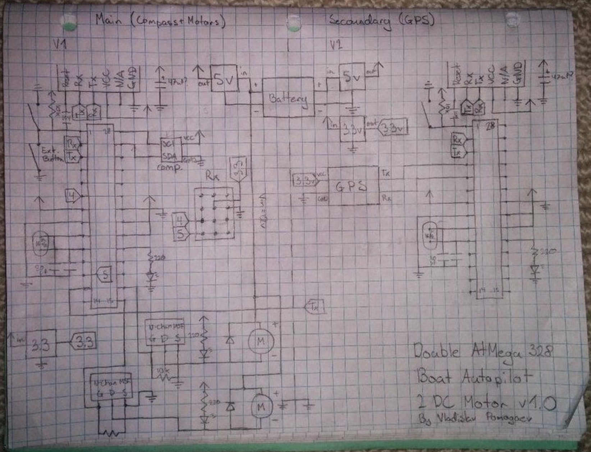

# RC BOAT
----
L'objectif est de construire un bateau autonome.

Exemple:

Pour atteindre cette objectif nous allons procéder par phases:

## Phase 1 (Etat des lieux)
L'objectif de cette phase est d'étudier le robot en notre possession, ensuite déterminer 

1. Définir un schéma électique du robot actuel

2. Choix des capteurs nécessaires (idéalement trouvé des cartes contenant le tout: 

	* gyroscope, acceleromètre, gps..., 
	* caméra
	* LIDAR (en option n'est pas obligatoire en première version)

	
	

3. Choix des cartes embarquées nécessaires
4. Choix des composants électroniques pour la commande des moteurs (Exemple: H-Bridge, Servo-moteur...)

	

5. Etude de l'étanchiété: l'objectif est d'avoir une vision sur comment on va protéger les composants électorniques
6. Etude les sources d'alimentation nécéssaires (batteries...). 

## Phase 2 (Vision cible)

1. Définir le shcéma électrique cible

2. Définir le montage mécanique cible
3. Définir le schéma énergitique cible
4. Définir les interfaces de communication (communication entre capteurs et carte embarquée, communication entre moteurs et carte embarquée, communication entre carte embarquée et ordianateur distant)

5. Phase familiarisation avec les cartes embarquées 
6. Acquisition du matériels

## Phase 3 (Réalisation)

1. Montage du bateau (énergitique, mécanique et électronique)
2. Programmation de la carte embarquée partie commande et partie acquisition des données depuis les capteurs
3. Tests unitaires
4. Tests d'intégrations

## Phase 4 (Tests)
Validation du prototype avec des tests grandeur nature.

## Sources

* Autonomous Boat - Build Log and Testing

Notes : 

	* Dimension: 600x390 mm
	* DST-700 brushless DC motor
	* HobbyKing 20A Blue ESC
	* Taranis X9D Plus
	* FrSky V8FR-II
	* APM 2.6

*  [ARDUPILOT](http://ardupilot.org/rover/docs/parameters.html)
*  Autonomous Box Boat - Long Range Waypoint Mission - RCTESTFLIGHT

Notes:

	* https://drive.google.com/file/d/17pscxfwTCLuxO1fSMs6sBwvtXfGYWXCk/view

* Boat Autopilot Project - Overview and Explaination

Notes: [LINK](https://www.instructables.com/id/Boat-Autopilot/)

